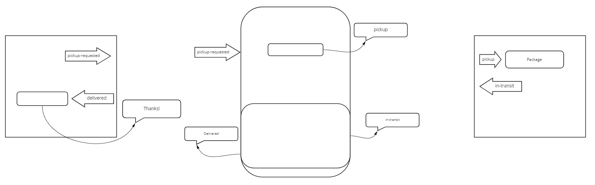

# CAPS - Events w/ Queue

An event driven application that “distributes” the responsibility for logging to separate modules, using only events to trigger logging based on activity, using a standard Queue system - for Code Fellows 401

## Installation

to install run `git clone git@github.com:Kellen-Linse/caps`

`cd` into caps

run `npm install`

## Usage

To start server run : `npm start`

## Whiteboard

